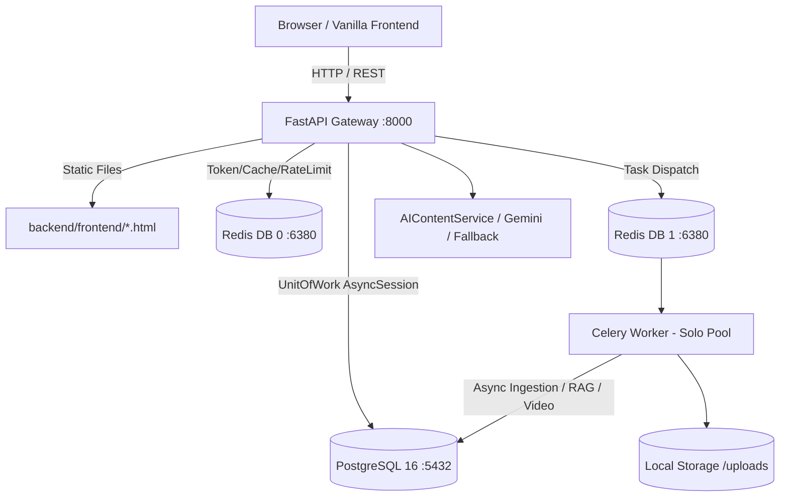

# EduVision 2.0 — Architecture Audit (C0 Forensic Baseline)

**Date:** 2026-09-06
**Status:** Completed
**Author:** Principal Architect & Production Reliability Lead
**Scope:** Full-stack forensic audit of backend framework, data stores, background task dispatch, frontend runtime, routing, security boundaries, and API topology.

---

## 1. Executive Architecture Baseline

EduVision AI is an educational platform designed to ingest educational presentations and documents (PPTX, PDF, DOCX), analyze and index them, generate interactive lessons and quizzes, track learner concept mastery and retention schedules, and provide AI-guided tutoring and video project rendering.

### Technology Stack Mapping
- **Backend Framework:** FastAPI 0.115.0+ running on Python 3.14 (Uvicorn ASGI server on `http://127.0.0.1:8000`).
- **Primary Database:** PostgreSQL 16 on `localhost:5432` (`eduvision`), SQLAlchemy 2.0 async engine via `asyncpg`, Alembic migrations (Current Head: `0034_video_projects`).
- **Cache & Rate Limiting:** Redis 7.4-alpine on `localhost:6380` (DB 0: application cache, sliding window rate limiter, revoked JWT list, OAuth state cache).
- **Background Worker & Broker:** Celery 5.4.0 (solo pool) using Redis DB 1 (`redis://localhost:6380/1`) as broker and result backend.
- **Frontend Framework:** Vanilla HTML5, modern CSS3 (custom dark theme, responsive grid, flexbox), and vanilla ES JavaScript with DOM manipulation, `fetch` API, and SVG graphics. No React/Vue/Vite build steps; served directly as static files mounted at `/frontend` by FastAPI with 302 root redirects.
- **File Storage:** Local filesystem storage abstraction (`app/storage/local.py`) rooted at `backend/data/uploads`, with S3/MinIO driver parity available.
- **AI Providers:** Unified `AIContentService` supporting Google Gemini (`gemini-1.5-flash`, `gemini-1.5-pro`), OpenAI, Anthropic, and local deterministic fallback.

---

## 2. Component & Service Topology



### Key Subsystems & File Locations
1. **API Routing Layer (`backend/app/api/v1/`):**
   - `auth.py`: JWT login, registration, token refresh, `/auth/me`.
   - `presentations.py`: Uploading documents (`POST /{id}/source`), manual deck creation, content extraction status, topics outline retrieval.
   - `player.py`: Lesson player start (`POST /lessons/{id}/player/start`), slide position save (`POST /lessons/{id}/player/position`), checkpoints, concept mastery.
   - `tutor.py`: AI Tutor sessions (`POST /tutor/sessions`), messages (`POST /tutor/sessions/{id}/messages`), message history (`GET /tutor/conversations/{id}/messages`), remediation (`POST /tutor/remediate`).
   - `video_projects.py`: P16 video projects creation (`POST /video-projects`), list (`GET /video-projects`), details (`GET /video-projects/{id}`), render dispatch.
   - `learner_progress.py`, `plan.py`, `goals.py`, `path.py`, `review.py`, `analytics.py`: Learner intelligence, spaced repetition, Ebbinghaus forgetting curves.

2. **Domain Service Layer (`backend/app/services/`):**
   - `content_extraction_service.py`: Extracts source files into `ContentUnit` and `ContentBlock`.
   - `topic_outline_service.py`: Generates 1-level slide ranges (`TopicOutline`).
   - `lesson_generation_service.py`: Generates `GeneratedLessonVersion` and `GeneratedBlock` items.
   - `lesson_player_service.py`: Manages active learner lesson session, position persistence, and checkpoints.
   - `mastery_tutor_service.py`: Assembles learner memory, weak concepts, RAG context, and produces tutor answers.
   - `visualization_decision_service.py`: 22-category visual matrix mapping educational topics to optimal visual representations.
   - `visual_persistence_service.py`: Persists SVG/Mermaid/HTML5 visual canvas records.
   - `video_project_builder.py` & `video_project_service.py`: Persistent storyboard, scenes, audio narrations, and Remotion rendering pipeline.

3. **Data Layer (`backend/app/models/` & `backend/app/repositories/`):**
   - 48 tables managed under single Alembic head `0034_video_projects`.
   - Core tables: `users`, `presentations`, `content_units`, `content_blocks`, `generated_lessons`, `generated_lesson_versions`, `generated_blocks`, `topic_outlines`, `learning_sessions`, `concept_mastery`, `tutor_sessions`, `tutor_conversations`, `tutor_messages`, `video_projects`.

---

## 3. Forensic Identification of Architectural Breakages

### Breakage 1: Session History 404 (`Could not load your session: history 404`)
- **Exact File:** `backend/frontend/tutor.html` lines 301–330.
- **Exact Code:**
  ```javascript
  async function resumeSession(sessionId) {
      state.sessionId = sessionId;
      const res = await authFetch(API + '/tutor/conversations/' + encodeURIComponent(sessionId) + '/messages?page=1&page_size=200');
      if (!res.ok) throw new Error('history ' + res.status);
      ...
  }
  ```
- **Backend Route:** `backend/app/api/v1/tutor.py` line 115:
  ```python
  @tutor_router.get("/conversations/{conversation_id}/messages")
  ```
- **Root Cause:**
  1. The frontend passes `sessionId` (e.g. `tus_a666...` from `TutorSession.public_id`) to an endpoint expecting `conversation_id` (e.g. `tconv_...` from `TutorConversation.public_id`).
  2. `TutorConversationRepository.get_for_user_or_raise` searches by `public_id == sessionId`, which returns `None` &rarr; raises `NotFoundError` (HTTP 404).
  3. Furthermore, when a tutor session is newly created, NO `TutorConversation` row is created until the learner sends their very first message! Thus, opening or refreshing an empty session inevitably returned 404.

### Breakage 2: Uploaded PPT Content Disconnected from Player (Problem B)
- **Exact Files:**
  - `backend/app/services/content_extraction_service.py` (lines 73–96)
  - `backend/app/services/lesson_player_service.py` (lines 82–119, 419–432)
  - `backend/frontend/player.html` (lines 343–365, 481–519)
- **Root Cause:**
  1. `ContentExtractionService` extracts PPT slides into `ContentUnit` (representing the slide) and `ContentBlock` (representing paragraphs, bullets, tables, and images).
  2. However, `player.html` ONLY invokes `/api/v1/lessons/{lessonId}/player/start`.
  3. `LessonPlayerService` extracts topics solely from `GeneratedLessonVersion.blocks` (`GeneratedBlock`), which only stores 3 heuristic or AI-generated summary sentences per topic!
  4. The player NEVER fetches `GET /api/v1/presentations/{id}/content`.
  5. The original PPT content (bullets, diagrams, speaker notes, tables) is never delivered to the player canvas. The player replaces the entire rich source with a generic 3-sentence summary card.

### Breakage 3: Slide-Wise Rather Than Topic-Wise Intelligence (Section 6 & 7)
- **Exact Files:**
  - `backend/app/services/topic_outline_service.py`
  - `backend/app/services/lesson_generation_service.py`
  - `backend/frontend/player.html`
- **Root Cause:**
  1. `TopicOutlineService` only outputs a flat list of `{ "title": str, "slide_ranges": [start, end] }`.
  2. It has no model or schema for **Subtopics**, **Concepts**, **Learning Objectives**, **Visual Strategies**, **Animation Strategies**, or **Common Misconceptions**.
  3. `player.html` hardcodes `slides.push({ kind: 'concept' }); slides.push({ kind: 'visual' })` per flat topic block, treating `1 block = 2 slides` mechanically rather than building a real multi-level topic/subtopic curriculum.

### Breakage 4: AI Tutor Generic & Leaking Internal Failures (Section 14, 15, 16)
- **Exact Files:** `backend/app/services/mastery_tutor_service.py` (lines 507–518, 803–839)
- **Root Cause:**
  1. When RAG chunks are cold or absent, `_produce_answer` short-circuits to `_deterministic_explanation` which outputs:
     *"Here's a focused summary on **this concept**... Your current mastery is **not yet measured**... There is no rich source material in your library matched to this question yet, so this answer is generated from your mastery data rather than a document."*
  2. It exposes internal data pipeline states ("no rich source material", "mastery data rather than a document") directly to students.
  3. It lacks the 3 tutor answer modes (Mode 1: Source-grounded, Mode 2: Source + enrichment, Mode 3: Outside source explanation).

---

## 4. Recommended Target Architecture

To evolve EduVision AI into **EduVision 2.0**, the architecture must be refined around a **Content Intelligence Layer**:

```
Document (PPTX/PDF/DOCX)
  └── Sections
        └── Topic (e.g. Networking Fundamentals)
              ├── Subtopic (e.g. Network Topologies)
              │     ├── Concept (e.g. Star vs Mesh)
              │     ├── Learning Objective
              │     ├── Core Explanation (Beginner & Detailed)
              │     ├── Real-World Analogy & Example
              │     ├── Visual Teaching Strategy (Flowchart, Diagram, Matrix)
              │     ├── Animation Sequence (Step-by-step process)
              │     ├── Video Strategy (Hook -> Mechanism -> Check)
              │     ├── Assessment Items (Formative checkpoint)
              │     └── Common Misconceptions
```

This layer bridges extracted `content_units` and `generated_lessons` directly into `player.html` (supporting Source Mode, Learning Mode, Visual Mode, and Presentation Workspace).
