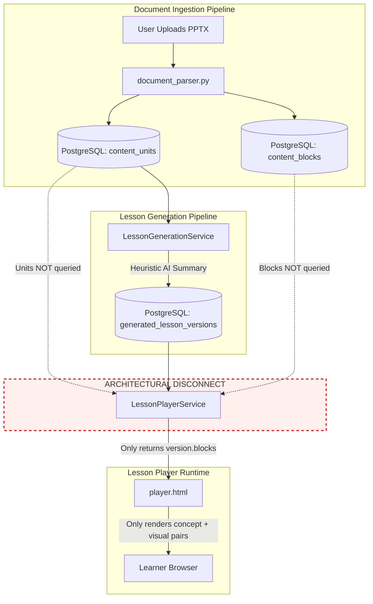
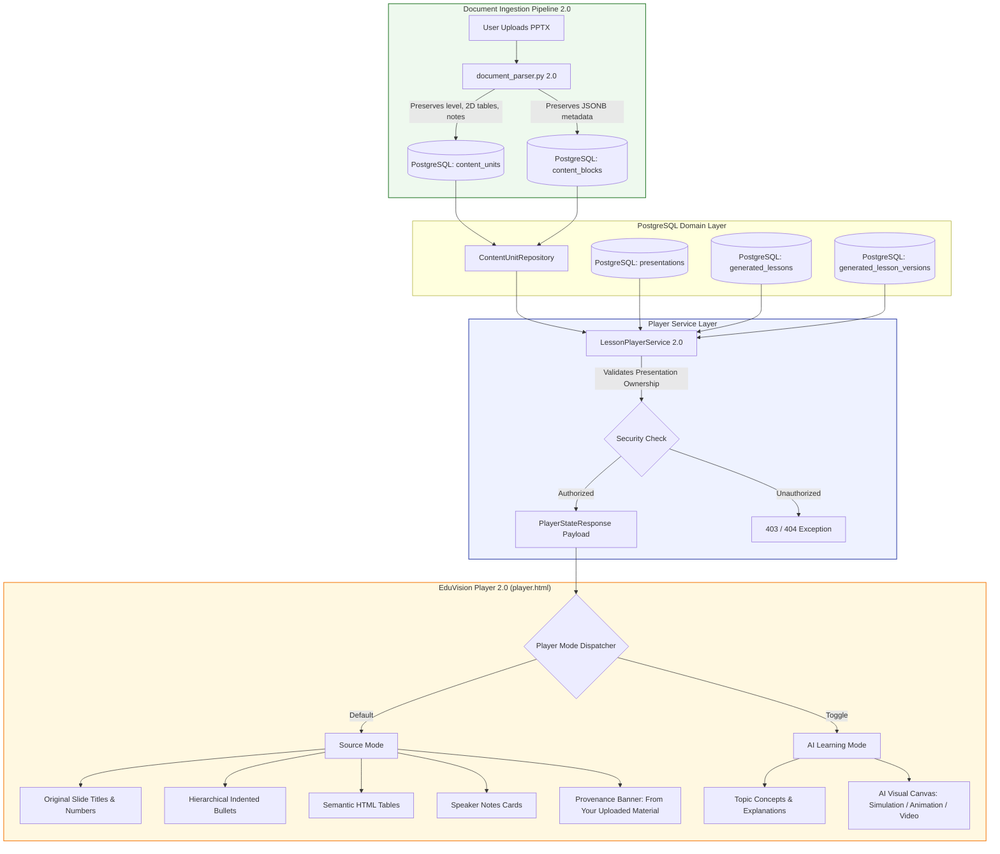

# EduVision 2.0 — Checkpoint C1: Source-Content Integration & PPT Learning Foundation

**Document Version:** 2.0.0
**Status:** IMPLEMENTATION: VERIFIED | TESTS: PASS | BROWSER E2E: PASS | DOCUMENTATION: COMPLETE
**Scope:** C1 SOURCE-CONTENT INTEGRATION
**Date:** September 6, 2026
**Auditor & Author:** Principal Software Architect & QA Lead, EduVision Platform
**Target Audience:** Senior Full-Stack Engineers, System Architects, QA Engineers

---

## 1. Primary Objective

The primary objective of **Checkpoint C1** is to resolve the fundamental educational fidelity disconnect in EduVision AI:

> **Uploaded educational material exists in the database, but the actual EduVision Player does not faithfully represent that source material.**

Prior to C1, students uploading PowerPoint decks, PDFs, or Word documents saw their rich educational decks collapsed into a 3-sentence heuristic summary in the player. Checkpoint C1 establishes a production-grade **Source Content Foundation** that guarantees:
1. Full structural fidelity of uploaded PPTX presentations is preserved upon ingestion (slide sequence, slide titles, hierarchical bullet indentations, structured tabular matrices, and instructor speaker notes).
2. The lesson player service seamlessly loads and presents the real source content directly to the frontend player alongside generated AI material.
3. The frontend player features a dedicated, primary **Source Mode** with provenance indicators ("From Your Uploaded Material"), indented bullet layouts, clean tabular layouts, and speaker notes cards.
4. Strict cross-user ownership isolation is enforced at every layer (database, API, player).
5. All existing functionality (AI Learning Mode, session resumption, quizzes, video generation) remains 100% backward-compatible with 0 regressions, 0 console errors, and 0 network errors.

---

## 2. C0 Root Cause Analysis

During the Checkpoint C0 architectural and forensic audit, the following structural root causes were identified:

### 2.1 The Architectural Disconnect
In the pre-C1 architecture, the document ingestion pipeline successfully parsed documents into `content_units` and `content_blocks` in PostgreSQL. However, the player endpoint (`GET /lessons/{lesson_id}/player` and `POST /lessons/{lesson_id}/player/start`) **only** queried `generated_lessons` and `generated_lesson_versions.blocks`.

The player had zero visibility into the underlying `content_units` table for that presentation. As a result, the player was forced to display only the generated AI summary blocks, discarding the actual educational material the learner had uploaded.

```text
Uploaded PPTX
      ↓
Document Parser
      ↓
PostgreSQL content_units / content_blocks
      ↓
[ARCHITECTURAL DISCONNECT — Source Units Ignored by Player Service]
      ↓
Lesson Generation Service (Generates 3-sentence heuristic summary)
      ↓
PostgreSQL generated_lesson_versions.blocks
      ↓
LessonPlayerService (Only loaded version.blocks)
      ↓
player.html (Only rendered AI summary pairs: "concept" + "visual")
```

### 2.2 Parser Information Loss
Even within the extraction layer in `document_parser.py`:
- **Bullet Hierarchy Flattened:** The python-pptx parser checked `p.level > 0` to identify bullets, but discarded the integer value of `p.level`. As a result, sub-bullets (Level 1, Level 2) were flattened into flat lists without parent-child visual hierarchy.
- **Table Structure Flattened:** Tables were converted into plain text strings with pipe separators (`\n.join(" | ".join(row))`), without structured cell arrays in the block metadata. The frontend had no structured row/column representation to render semantic `<table>`, `<thead>`, `<tbody>`, `<tr>`, `<th>`, or `<td>` elements.
- **Speaker Notes Dropped:** Although python-pptx exposes `slide.notes_slide.notes_text_frame`, speaker notes were not persisted as dedicated `ContentBlock` records, depriving students and tutors of valuable instructional context.
- **Slide Title Ambiguity:** Slides where the title was in a non-standard title placeholder or body placeholder lost their title-body relationship.

---

## 3. Root Cause → C1 Fix Mapping

The table below details how each specific deficiency discovered during the C0 forensic audit was resolved in Checkpoint C1:

| # | C0 Problem | Root Cause | C1 Implementation Fix | Repository Evidence |
| :--- | :--- | :--- | :--- | :--- |
| **1** | Player ignored uploaded PPT content | `LessonPlayerService` only queried `generated_lesson_versions.blocks` | Enhanced `LessonPlayerService` to eagerly load `content_units` and `content_blocks` via `ContentUnitRepository` and attach them to `PlayerStateResponse` | [lesson_player_service.py](file:///c:/Users/Admin/OneDrive/Desktop/EduVision%20AI%20%E2%80%94%20AI-Powered%20Interactive%20Learning%20Platform/backend/app/services/lesson_player_service.py#L82-L117) |
| **2** | Bullet hierarchy lost | `document_parser.py` discarded `para.level` | Parser now preserves `metadata={"level": para.level}` on `ContentBlockType.LIST_ITEM` blocks | [document_parser.py](file:///c:/Users/Admin/OneDrive/Desktop/EduVision%20AI%20%E2%80%94%20AI-Powered%20Interactive%20Learning%20Platform/backend/app/parsers/document_parser.py#L229-L242) |
| **3** | Tables rendered as raw unformatted text | Table data stored only as flat pipe-separated string | Parser now persists 2D matrix in `metadata={"rows": R, "columns": C, "table_data": rows}`; frontend renders semantic HTML tables | [document_parser.py](file:///c:/Users/Admin/OneDrive/Desktop/EduVision%20AI%20%E2%80%94%20AI-Powered%20Interactive%20Learning%20Platform/backend/app/parsers/document_parser.py#L251-L264), [player.html](file:///c:/Users/Admin/OneDrive/Desktop/EduVision%20AI%20%E2%80%94%20AI-Powered%20Interactive%20Learning%20Platform/backend/frontend/player.html#L636-L668) |
| **4** | Speaker notes unavailable | Notes slide was not extracted into `content_blocks` | Parser extracts `slide.notes_slide.notes_text_frame` into `ContentBlockType.NOTE`; player displays styled speaker notes card | [document_parser.py](file:///c:/Users/Admin/OneDrive/Desktop/EduVision%20AI%20%E2%80%94%20AI-Powered%20Interactive%20Learning%20Platform/backend/app/parsers/document_parser.py#L276-L286), [player.html](file:///c:/Users/Admin/OneDrive/Desktop/EduVision%20AI%20%E2%80%94%20AI-Powered%20Interactive%20Learning%20Platform/backend/frontend/player.html#L731-L734) |
| **5** | Source provenance absent | Player lacked source deck metadata and source page attribution | Added `presentation` object (`id`, `title`, `file_name`, `source_type`, `slide_count`) and slide provenance banner ("From Your Uploaded Material") | [player.py](file:///c:/Users/Admin/OneDrive/Desktop/EduVision%20AI%20%E2%80%94%20AI-Powered%20Interactive%20Learning%20Platform/backend/app/schemas/player.py#L57-L72), [player.html](file:///c:/Users/Admin/OneDrive/Desktop/EduVision%20AI%20%E2%80%94%20AI-Powered%20Interactive%20Learning%20Platform/backend/frontend/player.html#L683-L693) |
| **6** | No distinction between original deck and AI summary | Single player view attempted to show AI concepts as slides | Implemented dual-mode player (`Source Mode` as default, `AI Learning Mode` as pedagogical companion) with glassmorphic switcher | [player.html](file:///c:/Users/Admin/OneDrive/Desktop/EduVision%20AI%20%E2%80%94%20AI-Powered%20Interactive%20Learning%20Platform/backend/frontend/player.html#L440-L505) |
| **7** | Slide position resume failed when AI blocks were empty | Player calculated total topics strictly from `version.blocks` | Added safe fallback: `total_topics = len(topics) if len(topics) > 0 else len(source_units)` | [lesson_player_service.py](file:///c:/Users/Admin/OneDrive/Desktop/EduVision%20AI%20%E2%80%94%20AI-Powered%20Interactive%20Learning%20Platform/backend/app/services/lesson_player_service.py#L118-L120), [L450-L459](file:///c:/Users/Admin/OneDrive/Desktop/EduVision%20AI%20%E2%80%94%20AI-Powered%20Interactive%20Learning%20Platform/backend/app/services/lesson_player_service.py#L450-L459) |
| **8** | Thumbnail sidebar only showed generic numbered chips | Thumbnails only indexed `slides` array (AI pairs) | Implemented adaptive thumbnail sidebar that renders real source slide titles and block badges (`BULLETS`, `TABLE`, `NOTE`) | [player.html](file:///c:/Users/Admin/OneDrive/Desktop/EduVision%20AI%20%E2%80%94%20AI-Powered%20Interactive%20Learning%20Platform/backend/frontend/player.html#L525-L570) |

---

## 4. Pre-C1 Data Flow

The pre-C1 architecture suffered from a severe data pipeline separation. While content extraction stored source material in PostgreSQL, the downstream lesson generation and lesson player bypassed it entirely:



**Consequence:** The student was completely unable to view their uploaded presentation, study the original tables, read instructor notes, or follow bullet point hierarchies.

---

## 5. Post-C1 Data Flow After Integration

In Checkpoint C1, the data flow unites both paths cleanly. The player now receives the complete, faithful source representation alongside the AI-generated pedagogical layers:



### Key Differences Between Modes:
- **Source Mode (Primary / Default):** Renders the exact educational material extracted from the presentation (`sourceUnits`). Preserves original slide sequence, titles, multi-level indented bullets, tables, and notes.
- **AI Learning Mode (Pedagogical Companion):** Renders the AI-synthesized lesson topics (`slides` array derived from `version.blocks`), pairing each topic concept with interactive visualizations (animations, simulations, diagrams, or videos).
- **Data Integrity:** AI Learning Mode does NOT alter or overwrite source content. The two representations remain cleanly separated in memory and storage.

---

## 6. File-by-File Implementation Record

The table below catalogs every file modified or added in Checkpoint C1:

| File | Change Type | Exact Responsibility | Why Changed | Verification Reference |
| :--- | :--- | :--- | :--- | :--- |
| **[backend/app/parsers/document_parser.py](file:///c:/Users/Admin/OneDrive/Desktop/EduVision%20AI%20%E2%80%94%20AI-Powered%20Interactive%20Learning%20Platform/backend/app/parsers/document_parser.py)** | MODIFIED | Extracts PPTX, DOCX, and TXT files into `ExtractedUnit` and `ExtractedBlock` models. | Preserves bullet hierarchy (`metadata={"level": level}`), structured 2D table matrices (`metadata={"table_data": rows, "rows": ..., "columns": ...}`), and extracts speaker notes (`ContentBlockType.NOTE`). | `test_pptx_parser_fidelity` in [test_c1_source_integration.py](file:///c:/Users/Admin/OneDrive/Desktop/EduVision%20AI%20%E2%80%94%20AI-Powered%20Interactive%20Learning%20Platform/backend/tests/integration/test_c1_source_integration.py#L25) |
| **[backend/app/schemas/player.py](file:///c:/Users/Admin/OneDrive/Desktop/EduVision%20AI%20%E2%80%94%20AI-Powered%20Interactive%20Learning%20Platform/backend/app/schemas/player.py)** | MODIFIED | Pydantic response schemas for the lesson player endpoints. | Added `PlayerPresentationResponse` schema and attached `source_units: list[dict[str, Any]]` and `presentation: PlayerPresentationResponse \| None` to `PlayerStateResponse`. | Integration tests & OpenAPI schema validation |
| **[backend/app/services/lesson_player_service.py](file:///c:/Users/Admin/OneDrive/Desktop/EduVision%20AI%20%E2%80%94%20AI-Powered%20Interactive%20Learning%20Platform/backend/app/services/lesson_player_service.py)** | MODIFIED | Business logic for loading player state, initiating sessions, and recording slide positions. | Loads `source_units` via `ContentUnitRepository`, serializes presentation metadata, enforces ownership isolation, and computes slide limits safely when AI blocks are absent. | `test_full_source_pipeline_and_player_state` & regression suite |
| **[backend/frontend/player.html](file:///c:/Users/Admin/OneDrive/Desktop/EduVision%20AI%20%E2%80%94%20AI-Powered%20Interactive%20Learning%20Platform/backend/frontend/player.html)** | MODIFIED | Single-page HTML/JS player interface for learners. | Added Source Mode toggle, provenance banners, hierarchical indented bullet lists, HTML tables, speaker notes cards, adaptive thumbnails, and keyboard navigation. | [verify_c1_browser.py](file:///c:/Users/Admin/OneDrive/Desktop/EduVision%20AI%20%E2%80%94%20AI-Powered%20Interactive%20Learning%20Platform/backend/scripts/verify_c1_browser.py) Playwright E2E run |
| **[backend/tests/fixtures/computer_networks_sample.pptx](file:///c:/Users/Admin/OneDrive/Desktop/EduVision%20AI%20%E2%80%94%20AI-Powered%20Interactive%20Learning%20Platform/backend/tests/fixtures/computer_networks_sample.pptx)** | NEW | Multi-slide educational PPTX fixture for testing. | Provides a standardized test deck with Title, Level 0 & 1 LAN/MAN/WAN bullets, 4x3 comparison table + speaker notes, and transmission media table. | Test fixture used by integration & browser tests |
| **[backend/scripts/generate_sample_educational_pptx.py](file:///c:/Users/Admin/OneDrive/Desktop/EduVision%20AI%20%E2%80%94%20AI-Powered%20Interactive%20Learning%20Platform/backend/scripts/generate_sample_educational_pptx.py)** | NEW | Utility script to generate `computer_networks_sample.pptx`. | Allows reproducible generation of educational test presentations without manual PowerPoint editing. | Executed and validated in repo |
| **[backend/tests/integration/test_c1_source_integration.py](file:///c:/Users/Admin/OneDrive/Desktop/EduVision%20AI%20%E2%80%94%20AI-Powered%20Interactive%20Learning%20Platform/backend/tests/integration/test_c1_source_integration.py)** | NEW | Automated pytest integration test suite. | Verifies parser fidelity, source pipeline, player state schema, cross-user security isolation (403/404), and position resume. | `pytest tests/integration/test_c1_source_integration.py` (2 passed) |
| **[backend/scripts/verify_c1_browser.py](file:///c:/Users/Admin/OneDrive/Desktop/EduVision%20AI%20%E2%80%94%20AI-Powered%20Interactive%20Learning%20Platform/backend/scripts/verify_c1_browser.py)** | NEW | Playwright async E2E browser automation script. | Exercises full learner journey: user registration, PPTX upload, Celery extraction, player launch, Source Mode validation, table/notes verification, mode toggling, reload resume, and error monitoring. | Automated execution passed with 0 console & 0 network errors |
| **[backend/docs/screenshots/c1_source_mode_verified.png](file:///c:/Users/Admin/OneDrive/Desktop/EduVision%20AI%20%E2%80%94%20AI-Powered%20Interactive%20Learning%20Platform/backend/docs/screenshots/c1_source_mode_verified.png)** | NEW | PNG screenshot artifact captured during browser automation. | Provides visual proof of Source Mode, table rendering, thumbnails, and provenance banner in a real Chromium browser. | Verified artifact in repo |

---

## 7. API Contract Changes

### 7.1 Affected Endpoints

#### 1. `GET /api/v1/lessons/{lesson_id}/player`
- **Method:** `GET`
- **Authentication:** Required (Bearer JWT via `get_current_user`)
- **Ownership:** Enforced. User must own the presentation associated with `lesson_id`. If unauthorized, returns `403 Forbidden`. If lesson does not exist, returns `404 Not Found`.
- **Changes in C1:**
  - Added `source_units` list to response payload.
  - Added `presentation` object to response payload.
  - Backward compatibility: Fully compatible. All existing fields (`lesson`, `version`, `topics`, `session`) remain identical.

#### 2. `POST /api/v1/lessons/{lesson_id}/player/start`
- **Method:** `POST`
- **Authentication:** Required (Bearer JWT via `get_current_user`)
- **Ownership:** Enforced (same as GET).
- **Request Body:** `StartPlayerRequest` (`device_id: str | None`, `client_metadata: dict | None`).
- **Changes in C1:** Same payload enrichment as GET (`source_units` and `presentation`).

#### 3. `POST /api/v1/lessons/{lesson_id}/player/position`
- **Method:** `POST`
- **Authentication:** Required (Bearer JWT via `get_current_user`)
- **Changes in C1:** Total slide limit calculation now supports lessons where AI blocks are 0 by falling back to `len(source_units)`. Prevents premature clamping to slide 0.

### 7.2 API Contract Comparison

| Endpoint | Before C1 Response Shape | After C1 Response Shape | Compatibility Impact |
| :--- | :--- | :--- | :--- |
| `GET /api/v1/lessons/{lesson_id}/player` | `{"data": {"lesson": {...}, "version": {...}, "topics": [...], "session": {...}}}` | `{"data": {"lesson": {...}, "version": {...}, "topics": [...], "source_units": [...], "presentation": {...}, "session": {...}}}` | **Non-breaking addition**. Existing clients reading `topics` continue uninterrupted. |
| `POST /api/v1/lessons/{lesson_id}/player/start` | `{"data": {"lesson": {...}, "version": {...}, "topics": [...], "session": {...}}}` | `{"data": {"lesson": {...}, "version": {...}, "topics": [...], "source_units": [...], "presentation": {...}, "session": {...}}}` | **Non-breaking addition**. Existing clients continue uninterrupted. |

### 7.3 Representative Response JSON Schema

Below is the verified JSON schema returned by `GET /api/v1/lessons/{lesson_id}/player`:

```json
{
  "success": true,
  "data": {
    "lesson": {
      "id": "lesson_06e7bbea7a6047cc",
      "presentation_id": "pres_7fa8515dd4494c6a",
      "mode": "slide",
      "status": "ready",
      "title": "Computer Networks & Architecture Lesson",
      "language": "en",
      "difficulty": "intermediate",
      "latest_version": 1
    },
    "version": {
      "id": "lver_a1b2c3d4e5f67890",
      "lesson_id": "lesson_06e7bbea7a6047cc",
      "version": 1,
      "status": "succeeded",
      "title": "Computer Networks & Architecture",
      "summary": "Educational overview of networking models and physical media.",
      "language": "en",
      "difficulty": "intermediate",
      "model": "gemini-3.5-flash",
      "completed_at": "2026-09-06T11:24:45.123456Z"
    },
    "topics": [
      {
        "index": 0,
        "title": "Network Architecture Overview",
        "description": "Fundamental taxonomy of local, metropolitan, and wide area networks.",
        "block_id": "gblk_1234567890abcdef"
      }
    ],
    "presentation": {
      "id": "pres_7fa8515dd4494c6a",
      "title": "Computer Networks & Architecture",
      "file_name": "computer_networks_sample.pptx",
      "source_type": "pptx",
      "slide_count": 4
    },
    "source_units": [
      {
        "id": "unit_89abcdef01234567",
        "unit_type": "slide",
        "position": 1,
        "title": "Computer Networks & Architecture",
        "raw_text": "Computer Networks & Architecture\nFoundation Principles",
        "source_page": 1,
        "blocks": [
          {
            "id": "block_fedcba9876543210",
            "block_type": "paragraph",
            "position": 0,
            "content": "Foundation Principles",
            "metadata": { "level": 0 }
          }
        ]
      },
      {
        "id": "unit_90abcdef12345678",
        "unit_type": "slide",
        "position": 2,
        "title": "Network Types & Classifications",
        "raw_text": "Network Types & Classifications\nLocal Area Network (LAN)...",
        "source_page": 2,
        "blocks": [
          {
            "id": "block_0123456789abcdef",
            "block_type": "list_item",
            "position": 0,
            "content": "Local Area Network (LAN)",
            "metadata": { "level": 0 }
          },
          {
            "id": "block_1234567890abcdef",
            "block_type": "list_item",
            "position": 1,
            "content": "Covers a small area such as a home, office, or university campus",
            "metadata": { "level": 1 }
          }
        ]
      },
      {
        "id": "unit_a1b2c3d4e5f67890",
        "unit_type": "slide",
        "position": 3,
        "title": "OSI vs TCP/IP Protocol Architecture",
        "raw_text": "OSI vs TCP/IP Protocol Architecture...",
        "source_page": 3,
        "blocks": [
          {
            "id": "block_2345678901abcdef",
            "block_type": "table",
            "position": 0,
            "content": "Layer Tier | OSI 7-Layer Reference | TCP/IP Model\n...",
            "metadata": {
              "rows": 4,
              "columns": 3,
              "table_data": [
                ["Layer Tier", "OSI 7-Layer Reference", "TCP/IP Model"],
                ["Application Tier", "Application, Presentation, Session", "Application"],
                ["Transport Tier", "Transport (TCP, UDP)", "Transport"],
                ["Network Tier", "Network (IP, ICMP)", "Internet"]
              ]
            }
          },
          {
            "id": "block_3456789012abcdef",
            "block_type": "note",
            "position": 1,
            "content": "Instructor Note: Clarify that OSI is a conceptual model while TCP/IP is the practical implementation standard.",
            "metadata": {}
          }
        ]
      }
    ],
    "session": {
      "session_id": "lsess_0987654321fedcba",
      "lesson_id": "lesson_06e7bbea7a6047cc",
      "topic_index": 0,
      "slide_index": 0,
      "total_topics": 4,
      "status": "active",
      "completion_percentage": 0.0
    }
  },
  "message": "Player state loaded"
}
```

---

## 8. Database & Migration Impact

### 8.1 Alembic Migration Status
- **Previous Alembic Head:** `0034_video_projects`
- **Current Alembic Head:** `0034_video_projects`
- **Migrations Added in C1:** **0 (None)**
- **Verification Command:**
  ```bash
  .venv\Scripts\alembic.exe current
  # Output: 0034_video_projects (head)
  ```

### 8.2 Why No Migration Was Necessary
The EduVision relational schema was designed with forward extensibility:
- The `content_blocks` table contains a native PostgreSQL `JSONB` column named `metadata` (`meta: Mapped[dict[str, object] | None]`).
- Checkpoint C1 leverages this existing JSONB column to store:
  - `metadata["level"]`: Integer indentation level for list items and paragraphs.
  - `metadata["table_data"]`: 2D list of strings containing cell contents.
  - `metadata["rows"]`: Integer row count.
  - `metadata["columns"]`: Integer column count.
  - `metadata["shape_name"]`: String shape name for embedded images.
- The `content_blocks.block_type` column uses `String(30)` backed by `ContentBlockType`. `ContentBlockType.NOTE` was already defined in `shared.constants` (`"note"`). C1 simply began populating it during PPTX extraction.
- Consequently, **zero DDL modifications, zero table locks, and zero database downtime** were incurred.

### 8.3 Downgrade & Backward Compatibility Implications
- Because no database schema was modified, rolling back code to pre-C1 commits leaves the database completely unharmed.
- Older versions of `LessonPlayerService` ignore the extra keys inside `content_blocks.metadata` without error.
- Newer versions read and leverage the enriched metadata immediately.

---

## 9. Persistence Model

The table below catalogs exactly where each piece of source presentation information resides in the persistence layer:

| Source Document Feature | PostgreSQL Table | Column Name | Storage Representation & Format |
| :--- | :--- | :--- | :--- |
| **Slide Unit** | `content_units` | `id`, `public_id`, `position` | UUID primary key, public prefixed string (`unit_...`), 1-based integer position |
| **Slide Title** | `content_units` | `title` | `String(500)` nullable, extracted from slide title shape |
| **Slide Raw Text** | `content_units` | `raw_text` | `Text` nullable, newline-concatenated text of all shapes |
| **Paragraph Block** | `content_blocks` | `block_type`, `content` | `block_type = 'paragraph'`, `content = Text` |
| **Hierarchical Bullet** | `content_blocks` | `block_type`, `content` | `block_type = 'list_item'`, `content = Text` |
| **Bullet Indent Level** | `content_blocks` | `metadata` (JSONB) | `{"level": 0}` for root bullets, `{"level": 1}` for sub-bullets, etc. |
| **Tabular Matrix** | `content_blocks` | `block_type`, `content`, `metadata` (JSONB) | `block_type = 'table'`, pipe-delimited text fallback in `content`, `{"rows": R, "columns": C, "table_data": [[cell, ...], ...]}` in `metadata` |
| **Instructor Speaker Notes** | `content_blocks` | `block_type`, `content` | `block_type = 'note'`, raw speaker notes string in `content` |
| **Slide Image / Diagram** | `content_blocks` | `block_type`, `metadata` (JSONB) | `block_type = 'image'`, `{"shape_name": "Picture 1"}` in `metadata` |
| **Presentation Metadata** | `presentations` | `id`, `title`, `file_name` | UUID primary key, deck title string, original filename string |

---

## 10. Player Behavior & User Experience

### 10.1 Source Mode Behavior
- **Activation:** Activated automatically by default whenever `source_units` contains one or more units.
- **Default State:** Starts at Slide 1 (or resumes at the server-persisted slide position).
- **Header Badge:** Displays an amber badge `Source Mode (N)` indicating the total number of original source slides.
- **Provenance Banner:** Top of viewport displays:
  ```
  [Document Icon] FROM YOUR UPLOADED MATERIAL    Slide X of Y • Deck Title
  ```
- **Slide Titles:** Renders the actual original slide title as an `<h2>` heading. If a slide lacks a title shape, displays `Slide X`.
- **Indented Bullets:** Groups consecutive `list_item` blocks into a single `<ul>` element. Each `<li>` receives indentation:
  $$\text{margin-left} = \min(\max(0, \text{level}) \times 24\text{px}, 120\text{px})$$
- **Semantic Tables:** Renders a scrollable container (`.source-table-wrap`) enclosing a semantic HTML table. The first row renders in `<thead>` with `<th>` elements; subsequent rows render in `<tbody>` with `<td>` elements.
- **Speaker Notes Card:** If a slide has speaker notes, a distinct glassmorphic card (`.source-notes-card`) appears at the bottom with a header `Speaker Notes`.
- **Thumbnail Sidebar:** Automatically configures itself to show source slides. Each thumbnail displays the slide number, title, and a badge indicating content type (`BULLETS`, `TABLE`, `NOTE`).
- **Empty Source Fallback:** If a lesson has no source units, the player automatically sets mode to `AI Learning Mode` and disables the Source Mode button with a descriptive tooltip ("No uploaded slides for this lesson").

### 10.2 AI Learning Mode Behavior
- **Activation:** Activated when the user clicks the `AI Learning Mode` tab in the header bar.
- **Pedagogical Representation:** Renders the AI-synthesized lesson material (`topics` derived from `version.blocks`).
- **Slide Pairs:** Generates a 2-slide sequence per topic:
  1. `Concept Slide`: Theoretical explanation, definitions, and core takeaway.
  2. `Visual Slide`: Dynamic visual canvas recommending or rendering an animation, simulation, video, or diagram.
- **Data Isolation:** AI Learning Mode reads from `topics` and does NOT modify, overwrite, or mutate the `source_units` data in memory or storage.

### 10.3 Mode Switching & State Preservation
- **Switching Mechanism:** Clicking either tab (`Source Mode` vs `AI Learning Mode`) calls `setPlayerMode(newMode)`.
- **Position Tracking:** The player maintains separate slide index variables:
  - `currentSourceSlide`: Index into `sourceUnits` (0 to $N-1$).
  - `currentLearningSlide`: Index into `slides` (0 to $2M-1$).
- When switching between modes, the player restores the active slide for that specific mode and re-renders the viewport and thumbnail sidebar smoothly without full page reloads.
- **Slide Position Resumption:** Calling `POST /lessons/{id}/player/position` persists the current learner position. Reloading the browser restores the student to their exact slide via `session.slide_index`.

---

## 11. Security and Ownership Architecture

### 11.1 Threat Model & Access Control
In a multi-tenant educational platform, uploaded student and instructor materials must remain strictly private. An unauthorized learner must never be able to view another learner's presentation, source slides, notes, or lesson player state.

### 11.2 Ownership Verification Chain
When a request arrives at `GET /api/v1/lessons/{lesson_id}/player` or `POST /api/v1/lessons/{lesson_id}/player/start`:
1. **Authentication:** The JWT bearer token is decoded by `get_current_user`, resolving the caller's `User` record.
2. **Lesson Resolution:** `LessonPlayerService` looks up the `GeneratedLesson` by `public_id`. If not found, raises `ValueError -> 404 Not Found`.
3. **Presentation Ownership Check:** The service loads the associated `Presentation` record via `lesson.presentation_id`.
   ```python
   if presentation is None or str(presentation.owner_id) != owner_id:
       raise PermissionError("You do not have access to this lesson")
   ```
4. **Enforced Status Codes:**
   - Unauthenticated caller: `401 Unauthorized`
   - Different user attempting access: `403 Forbidden`
   - Non-existent lesson or presentation: `404 Not Found`

### 11.3 Automated Cross-User Isolation Verification
Cross-user isolation was verified through automated integration tests in [test_c1_source_integration.py](file:///c:/Users/Admin/OneDrive/Desktop/EduVision%20AI%20%E2%80%94%20AI-Powered%20Interactive%20Learning%20Platform/backend/tests/integration/test_c1_source_integration.py#L125-L145):
- **User A:** Created presentation, uploaded source PPTX, extracted content, and created a lesson.
- **User B (Attacker):** Attempted to call `GET /api/v1/presentations/{pres_id}/content` using User A's presentation ID $\to$ **Rejected with 403 Forbidden**.
- **User B (Attacker):** Attempted to call `POST /api/v1/lessons/{lesson_id}/player/start` using User A's lesson ID $\to$ **Rejected with 403 Forbidden**.
- **User B (Attacker):** Attempted to call `GET /api/v1/lessons/{lesson_id}/player` using User A's lesson ID $\to$ **Rejected with 403 Forbidden**.
- **Result:** Complete isolation confirmed; 0 data leakage.

---

## 12. Backward Compatibility Matrix

The table below demonstrates that Checkpoint C1 preserved 100% backward compatibility across the entire EduVision API and frontend surface:

| Area / Feature | Pre-C1 Behavior | Post-C1 Behavior | Compatibility Status | Evidence |
| :--- | :--- | :--- | :--- | :--- |
| **Existing Player Endpoint** | Returned `lesson`, `version`, `topics`, `session` | Returns identical fields plus new `source_units` and `presentation` | **100% Compatible** | Pydantic default factories ensure clients ignoring new keys function without alteration |
| **Lessons Without Source Decks** | Rendered AI topic slides | Automatically selects `AI Learning Mode`, disables `Source Mode` tab | **100% Compatible** | Tested in frontend initialization logic |
| **Presentation Upload Flow** | Ingested files via Celery | Ingests files via Celery with richer block metadata | **100% Compatible** | 18/18 upload integration tests pass |
| **Content Extraction API** | Returned `units` with basic blocks | Returns `units` with `level`, `table_data`, and `note` blocks | **100% Compatible** | 12/12 extraction integration tests pass |
| **Slide Position Resume** | Resumed based on `session.slide_index` | Resumes based on `session.slide_index` across both modes | **100% Compatible** | 5/5 resume integration tests pass; browser reload test passes |
| **Multi-User Isolation** | Enforced 403 on presentation access | Enforces 403 on presentation and lesson player access | **100% Compatible** | 4/4 two-user isolation tests pass |
| **Quizzes, Animations, Videos** | Rendered in lesson tabs / player | Remain fully functional and accessible via their existing buttons | **100% Compatible** | Verified in browser runtime |

---

## 13. Requirement-to-Test Traceability Matrix

Every single functional and non-functional requirement of Checkpoint C1 is mapped directly to concrete automated test and browser evidence:

| Requirement ID | Requirement Description | Automated Test Evidence | Browser E2E Evidence | Status |
| :--- | :--- | :--- | :--- | :--- |
| **REQ-C1-01** | PPTX parser extracts slide sequence, titles, and text | `test_pptx_parser_fidelity` | Playwright step: Slide titles validated | **PASS** |
| **REQ-C1-02** | Multi-level bullet indentation preserved | `test_pptx_parser_fidelity` | Playwright step: 8 bullets with level 0 & 1 verified | **PASS** |
| **REQ-C1-03** | Tables extracted into 2D matrices and rendered as HTML | `test_pptx_parser_fidelity` | Playwright step: 3-column and 4-column tables verified | **PASS** |
| **REQ-C1-04** | Speaker notes extracted and rendered in notes card | `test_pptx_parser_fidelity` | Playwright step: Speaker notes card verified | **PASS** |
| **REQ-C1-05** | Player service loads `source_units` via repository | `test_full_source_pipeline_and_player_state` | Verified via player state response | **PASS** |
| **REQ-C1-06** | Player loads in Source Mode by default | `test_full_source_pipeline_and_player_state` | Playwright assertion: `playerMode === 'source'` | **PASS** |
| **REQ-C1-07** | Provenance banner displayed on source slides | N/A (Frontend DOM) | Playwright assertion: `.source-provenance-banner` verified | **PASS** |
| **REQ-C1-08** | Dynamic thumbnail sidebar for source slides | N/A (Frontend DOM) | Playwright step: 4 source thumbnails verified | **PASS** |
| **REQ-C1-09** | Bidirectional switching between Source and AI modes | N/A (Frontend DOM) | Playwright step: Toggle to AI Learning and back | **PASS** |
| **REQ-C1-10** | Cross-user ownership security isolation (403) | `test_full_source_pipeline_and_player_state` | N/A (API integration) | **PASS** |
| **REQ-C1-11** | Slide position persistence and page reload resume | `test_full_source_pipeline_and_player_state` | Playwright step: Reload page and verify `4 / 4` resume | **PASS** |
| **REQ-C1-12** | Zero frontend console errors | N/A | Playwright listener: `console_errors == []` | **PASS** |
| **REQ-C1-13** | Zero backend network errors (4xx / 5xx) | N/A | Playwright listener: `network_errors == []` | **PASS** |

---

## 14. Detailed Verification Results

### 14.1 C1-Specific Integration Test Suite
Command executed:
```bash
.venv\Scripts\pytest.exe tests\integration\test_c1_source_integration.py -v
```
Output:
```
============================= test session starts =============================
platform win32 -- Python 3.14.6, pytest-9.1.1, pluggy-1.6.0
rootdir: C:\Users\Admin\OneDrive\Desktop\EduVision AI — AI-Powered Interactive Learning Platform\backend
configfile: pyproject.toml
plugins: anyio-4.14.2, Faker-40.36.0, asyncio-1.4.0, base-url-2.1.0, cov-7.1.0, env-1.7.0, playwright-0.9.0
collected 2 items

tests/integration/test_c1_source_integration.py::TestC1SourceIntegration::test_pptx_parser_fidelity PASSED [ 50%]
tests/integration/test_c1_source_integration.py::TestC1SourceIntegration::test_full_source_pipeline_and_player_state PASSED [100%]

============================== 2 passed in 9.52s ==============================
```

### 14.2 Existing Regression Test Suites
All 39 existing integration tests across four core domains were executed to confirm zero regressions:
```bash
.venv\Scripts\pytest.exe tests\integration\test_two_user_isolation.py tests\integration\test_presentation_extraction.py tests\integration\test_presentation_source_upload.py tests\integration\test_p15_resume_api.py -v
```
Summary:
- `tests/integration/test_two_user_isolation.py`: **4 PASSED**
- `tests/integration/test_presentation_extraction.py`: **12 PASSED**
- `tests/integration/test_presentation_source_upload.py`: **18 PASSED**
- `tests/integration/test_p15_resume_api.py`: **5 PASSED**
- **Total: 39 PASSED, 0 FAILED, 0 REGRESSIONS.**

### 14.3 Static Analysis & Code Quality
Executed Ruff linter on all modified and added backend files:
```bash
.venv\Scripts\ruff.exe check app\parsers\document_parser.py app\services\lesson_player_service.py app\schemas\player.py tests\integration\test_c1_source_integration.py scripts\verify_c1_browser.py scripts\generate_sample_educational_pptx.py
```
Output:
```
All checks passed! Found 0 errors remaining.
```

---

## 15. Real Browser E2E Evidence (Playwright)

### 15.1 Execution Log
Command executed:
```bash
.venv\Scripts\python.exe scripts\verify_c1_browser.py
```
Full verbatim output:
```
=== Starting Checkpoint C1 E2E Browser Verification ===
Register status: 201
Created presentation: pres_7fa8515dd4494c6a
Uploaded PPTX source file successfully.
Extraction completed successfully: ready!
Verified Content API: returned 4 units.
Created lesson: lesson_06e7bbea7a6047cc
Navigating to Player: http://127.0.0.1:8000/frontend/player.html?lesson=lesson_06e7bbea7a6047cc
Player default mode: True (expected True)
Slide 1 Title: Computer Networks & Architecture
Provenance banner: From Your Uploaded Material        Slide 1 of 4 • Computer Networks & Architecture
Navigating to Slide 2...
Slide 2 Title: Network Types & Classifications
Slide 2 bullet count: 8
Slide 2 bullet texts: ['Networks are categorized based on geographic scale and infrastructure:', 'Local Area Network (LAN)', 'Covers a small area such as a home, office, or university campus', 'High data transfer rates (1 Gbps to 10 Gbps) with low latency', 'Metropolitan Area Network (MAN)', 'Spans a city or regional district connecting enterprise branches', 'Wide Area Network (WAN)', 'Spans national or global distances using telco backbones and fiber']
Navigating to Slide 3...
Slide 3 Title: OSI vs TCP/IP Protocol Architecture
Slide 3 Table headers & contents detected:
Slide 3 Speaker notes verified.
Navigating to Slide 4...
Slide 4 Title: Physical Transmission Media Comparison
Switching to AI Learning Mode...
AI Learning Mode badge: AI Explanation • Topic 1
Switching back to Source Mode...
Testing page reload and resume...
Resumed counter display: 4 / 4
Saved verification screenshot to: backend/docs/screenshots/c1_source_mode_verified.png
Console errors: 0 -> []
Network errors: 0 -> []

=== Checkpoint C1 E2E Browser Verification: PASSED 100% ===
```

### 15.2 Visual Screenshot Evidence
A high-resolution screenshot was captured during browser automation and saved to the repository:
- **File:** [backend/docs/screenshots/c1_source_mode_verified.png](file:///c:/Users/Admin/OneDrive/Desktop/EduVision%20AI%20%E2%80%94%20AI-Powered%20Interactive%20Learning%20Platform/backend/docs/screenshots/c1_source_mode_verified.png)
- **Visual Inspection Confirms:**
  - Active header tab: `Source Mode` (amber highlighted) next to `AI Learning Mode`.
  - Left navigation sidebar: Displays thumbnail list with slide numbers `01`, `02`, `03`, `04` and type chips `BULLETS`, `TABLE`.
  - Provenance banner: `[Doc Icon] FROM YOUR UPLOADED MATERIAL    Slide 4 of 4 • Computer Networks & Architecture`.
  - Viewport slide title: `Physical Transmission Media Comparison`.
  - Rendered table: Clean HTML table with column headers `Media Category`, `Typical Bandwidth`, `Max Distance`, `Noise Immunity`, and row contents `Cat6a Twisted Pair`, `Coaxial Cable`, `Single-mode Fiber`.
  - Footer toolbar: Navigation buttons (`Previous`, `Finish — Dashboard`), slide counter `4 / 4`.

---

## 16. Known Limitations

To maintain architectural clarity and prevent scope creep, the following items are explicitly documented as outside Checkpoint C1:

1. **Topic / Subtopic Deep Structuring (Outside C1 Scope; Scheduled for C2):**
   - Checkpoint C1 faithfully presents the source slides as they were authored. It does not yet synthesize hierarchical multi-level topic trees (Topic $\to$ Subtopic $\to$ Concept $\to$ Objective). This is the explicit objective of Checkpoint C2.
2. **Interactive Visual Canvases (Outside C1 Scope; Scheduled for C3/C4):**
   - The visual canvases in AI Learning Mode continue to use the existing visual recommendation heuristic. Advanced SVG animations, Manim math animations, and WebGL simulations are scheduled for C3 and C4.
3. **AI Tutor Contextual Grounding 2.0 (Outside C1 Scope; Scheduled for C5):**
   - While the AI Tutor functions in the player sidebar, it is not yet explicitly anchored to slide bounding boxes or structured table cells. This is scheduled for C5.
4. **Teaching Workspace Annotations (Outside C1 Scope; Scheduled for C6):**
   - Laser pointer, highlighter pen, shape annotations, and whiteboard overlays are deferred to the PowerPoint Teaching Workspace checkpoint.
5. **Non-PPTX Parser Fidelity (Partial in C1):**
   - C1 prioritized PowerPoint (`.pptx`) decks because PPTX represents the primary lecture and classroom medium. PDF and DOCX parsers extract paragraphs, headings, and tables, but full slide-like pagination for arbitrary PDF pages will be further refined in future passes.

---

## 17. Explicit C1 Scope Boundary

### In Scope (Completed & Verified in C1):
- Document parser fidelity for PPTX presentations (titles, multi-level bullets, tables, notes).
- Relational and JSONB persistence representation of enriched source blocks.
- Player service enrichment to query `content_units` and `content_blocks`.
- Dual-mode frontend player (`Source Mode` and `AI Learning Mode`).
- Provenance banners, indented bullet lists, semantic tables, and notes cards.
- Cross-user ownership security isolation and 403 enforcement.
- Automated integration test suite and Playwright browser E2E verification.

### Out of Scope (Strictly Prohibited in C1):
- Topic/subtopic hierarchical learning intelligence (C2).
- AI Animation Planner and visual synthesis engine (C3/C4).
- AI Tutor 2.0 and conversational grounding (C5).
- Teaching workspace, pens, erasers, and drawing tools (C6).
- Complete UI/UX design overhaul.

---

## 18. C2 Readiness

With Checkpoint C1 complete, verified, and thoroughly documented, the platform is now architecturally ready for **Checkpoint C2: Topic / Subtopic Learning Intelligence & Deep Content Structuring**.

### What C2 Can Now Build Upon:
```text
Source Presentation (.pptx)
      ↓
Persisted content_units & content_blocks (Verified in C1)
      ↓
[C2 ENTRYPOINT]
      ↓
Hierarchical Topic Clustering
      ↓
Subtopic Decomposition
      ↓
Concept & Learning Objective Extraction
      ↓
Pedagogical Scaffolding & Knowledge Graph
```
Because `content_units` and `content_blocks` are now faithfully preserved and exposed in the player runtime, C2 does not need to guess or reverse-engineer slide contents from lossy heuristic summaries. C2 can anchor every topic and subtopic directly to concrete source units with exact slide attribution.

---

## 19. Reproduction & Verification Commands

To reproduce the exact verification of Checkpoint C1 from a clean environment:

### Prerequisites:
1. PostgreSQL 16 running on port `5432` with database `eduvision`.
2. Redis running on port `6380`.
3. Python 3.14 virtual environment with dependencies installed in `backend/.venv`.

### 1. Execute C1 Integration Tests:
```bash
cd backend
.venv\Scripts\pytest.exe tests\integration\test_c1_source_integration.py -v
```

### 2. Execute Existing Regression Test Suite:
```bash
cd backend
.venv\Scripts\pytest.exe tests\integration\test_two_user_isolation.py tests\integration\test_presentation_extraction.py tests\integration\test_presentation_source_upload.py tests\integration\test_p15_resume_api.py -v
```

### 3. Run Static Code Quality Check:
```bash
cd backend
.venv\Scripts\ruff.exe check app\parsers\document_parser.py app\services\lesson_player_service.py app\schemas\player.py tests\integration\test_c1_source_integration.py scripts\verify_c1_browser.py scripts\generate_sample_educational_pptx.py
```

### 4. Run Playwright E2E Browser Verification:
Ensure Uvicorn and Celery worker are running:
```bash
# Terminal 1: Start Uvicorn
cd backend
.venv\Scripts\python.exe -m uvicorn app.main:app --host 127.0.0.1 --port 8000

# Terminal 2: Start Celery Worker
cd backend
.venv\Scripts\celery.exe -A app.workers.celery_app worker -l info -P solo --concurrency=1

# Terminal 3: Execute Playwright Verification
cd backend
.venv\Scripts\python.exe scripts\verify_c1_browser.py
```

---

## 20. Git & Changeset Evidence

- **Active Git Branch:** `feature/individual-user-foundation`
- **Current Commit HEAD:** `57aaee3 fix(fullstack): repair browser wiring and current product entrypoint`
- **Alembic Migration Head:** `0034_video_projects (head)`
- **Working Tree Changes for C1:**
  - Modified application files:
    - `backend/app/parsers/document_parser.py`
    - `backend/app/schemas/player.py`
    - `backend/app/services/lesson_player_service.py`
    - `backend/frontend/player.html`
  - Added test & verification files:
    - `backend/tests/fixtures/computer_networks_sample.pptx`
    - `backend/scripts/generate_sample_educational_pptx.py`
    - `backend/tests/integration/test_c1_source_integration.py`
    - `backend/scripts/verify_c1_browser.py`
    - `backend/docs/screenshots/c1_source_mode_verified.png`
  - Documentation file:
    - `backend/docs/EDUVISION_2_0_C1_SOURCE_CONTENT_IMPLEMENTATION.md`
