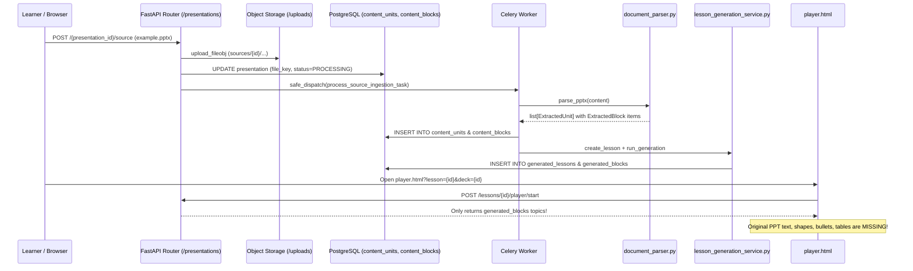

# EduVision 2.0 — Content Pipeline Audit (C0 Forensic Baseline)

**Date:** 2026-09-06
**Status:** Completed
**Subject:** Ingestion, Text/Structure Extraction, Topic & Subtopic Intelligence, and Player Data Delivery.

---

## 1. End-to-End Content Ingestion Lifecycle

The content pipeline begins when a learner uploads an educational file (PPTX, PDF, or DOCX) to EduVision:



---

## 2. In-Depth Step-by-Step Analysis

### Step 1: Upload & Persistence
- **File:** `backend/app/api/v1/presentations.py` (`upload_source`) and `backend/app/services/presentation_service.py` (`set_source`).
- **Mechanism:** Files are bounded by `settings.UPLOAD_MAX_FILE_SIZE` (default 50MB), verified via `validate_magic_bytes`, uploaded to local storage under `sources/{public_id}/{uuid}_{filename}`, and committed to PostgreSQL before task dispatch.
- **Status:** **WORKING**. Storage and DB state transitions are secure and robust.

### Step 2: Document Parsing
- **File:** `backend/app/parsers/document_parser.py`.
- **Functions:**
  - `parse_pptx`: Uses `python-pptx` to iterate over slides, reading `slide.shapes.title`, text frame paragraphs (categorized into `PARAGRAPH` or `LIST_ITEM` based on indentation level), tables (`TABLE`), and picture shapes.
  - `parse_pdf`: Uses `pypdf.PdfReader` to extract raw text and split by page boundaries.
  - `parse_docx`: Uses `python-docx` to extract heading hierarchies and body text.
- **Output:** Returns `list[ExtractedUnit]`, where each unit has `position`, `title`, `raw_text`, and a list of typed `ExtractedBlock` elements.
- **Status:** **WORKING**. The parser successfully extracts slide titles, bullets, tables, and raw text.

### Step 3: Source Content Persistence
- **File:** `backend/app/services/content_extraction_service.py`.
- **Database Tables:**
  - `content_units`: Stores each slide as a unit (`unit_type='slide'`, `position`, `title`, `raw_text`, `source_page`).
  - `content_blocks`: Stores each text paragraph, list item, or table within that slide (`block_type`, `position`, `content`, `metadata`).
- **Status:** **WORKING**. The full extracted slide content is safely persisted in the database.

### Step 4: Topic & Outline Detection
- **File:** `backend/app/services/topic_outline_service.py`.
- **Flaw Identified:**
  - Prompt strictly requests: `{'title': string, 'topics': [{'title': string, 'slide_ranges': [start, end]}]}`.
  - It collapses the entire document into 3 to 12 top-level slide groupings.
  - **It completely ignores subtopics, key concepts, formulas, code snippets, visual strategies, and learning objectives.**
  - There is no hierarchical tree connecting a topic to its subtopics and atomic concepts.

### Step 5: Lesson Generation
- **File:** `backend/app/services/lesson_generation_service.py`.
- **Flaw Identified:**
  - In `run_generation`, if AI generation is skipped or in heuristic mode (`_build_heuristic_payload`):
    ```python
    for idx, unit in enumerate(units):
        topic_title = getattr(unit, "title", None) or f"Topic {idx + 1}"
        ...
        sentences = [s.strip() for s in re.split(r"[.!?\n]+\s*", text) if len(s.strip()) > 15]
        best = sorted(sentences, key=len, reverse=True)[:3]
        description = ". ".join(best)
    ```
  - It picks 3 random long sentences from the slide and generates a single `GeneratedBlock` with that description.
  - **All rich formatting, bullet points, code, and structured tables are discarded.**

### Step 6: Player Retrieval & Rendering
- **File:** `backend/app/services/lesson_player_service.py` and `backend/frontend/player.html`.
- **The Core Disconnect (Problem B Root Cause):**
  1. `LessonPlayerService.get_state` and `start` only query `GeneratedLessonVersion.blocks`.
  2. `player.html` reads `state.topics`, and then generates artificial slides:
     - Slide `2*i`: `Concept` slide displaying `t.title` and `t.description` (the 3-sentence summary).
     - Slide `2*i + 1`: `Visual` slide with a placeholder generator.
  3. **The player NEVER fetches or renders `content_units` or `content_blocks`!**
  4. The learner never sees their uploaded PPT slides. They only see an AI summary card that often omits the specific definitions, examples, formulas, and diagrams that were in the original presentation.

---

## 3. The Required Fix for Problem B

To genuinely solve Problem B and satisfy Section 5, 6, 7, and 8:

1. **Unified Content Ingestion & Topic-Intelligence Pipeline:**
   - When extracting PPTX/PDF files, retain full fidelity of source slides in `content_units` and `content_blocks`.
   - Enhance topic detection (`TopicOutlineService` / `ContentIntelligenceService`) to output a true hierarchical taxonomy:
     `Document -> Section -> Topic -> Subtopics -> Concepts`.
   - Each Concept must encapsulate:
     - `name` and `definition`
     - `learning_objective`
     - `source_reference` (which slide/page numbers and blocks it originated from)
     - `detailed_explanation`
     - `real_world_example`
     - `analogy`
     - `visual_strategy` (Flowchart, Block Diagram, Comparison, etc.)
     - `common_misconceptions`

2. **Player Multi-Mode Presentation Architecture:**
   - In `backend/frontend/player.html`, introduce dedicated view modes:
     - **Source Mode (Original Slide View):** Renders the authentic source content (slide title, exact bullet points, formatted tables, original slide order).
     - **Learning Mode (AI Teacher Explanation):** Renders the structured topic/subtopic concept breakdown, simplified explanation, analogy, and real-world example.
     - **Visual Mode (Interactive Visual Canvas):** Automatically renders the corresponding visual (flowchart, timeline, animated state diagram, architecture graph) tailored to the concept.
     - **Teaching Mode (PowerPoint Tools):** Overlays canvas annotation tools (pen, highlighter, laser, shapes, spotlight).
   - This ensures the student NEVER loses their original study material, while enjoying full AI educational enrichment.
