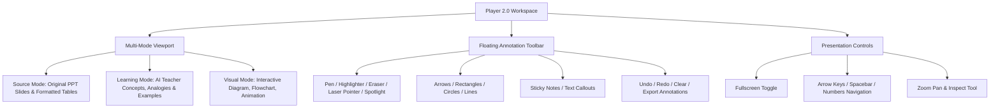

# EduVision 2.0 — UI/UX & Player Experience Audit (C0 Forensic Baseline)

**Date:** 2026-09-06
**Status:** Completed
**Subject:** User Interface Modernization, Player 2.0 Workspace, PowerPoint-Style Teaching Tools, and Learner Ergonomics.

---

## 1. Evaluation of Current Interface (Problem A: Outdated UI)

A comprehensive visual and functional inspection was conducted across all 7 frontend interfaces in `backend/frontend/`:

### 1.1 Dashboard (`dashboard.html`)
- **Strengths:** Functional layout with stats cards (streak, mastery score, concepts reviewed), recent decks table, and action shortcuts.
- **Weaknesses:**
  - High density of administrative metadata rather than answering the core pedagogical question: *"What should I learn next?"*.
  - Lacks dynamic visual progress rings, interactive learning path nodes, and animated micro-interactions.
  - "Continue Learning" CTA lacks deep-link contextual resumption into the exact active subtopic.

### 1.2 Lesson Player (`player.html`)
- **Strengths:** Fast rendering, slide thumbnails on sidebar, slide counter, and persistent position synchronization.
- **Critical Gaps:**
  - **No Teaching Tools:** Completely lacks annotation tools (no pen, marker, highlighter, laser pointer, shapes, sticky notes, spotlight, or zoom).
  - **Single Rigid View:** Merely switches between "Concept" text and a bare "Visual" container. Lacks Source Mode (original PPT view), Learning Mode (AI teacher view), and Fullscreen Presentation Mode.
  - **Visual Styling:** Monochromatic dark theme with minimal visual hierarchy; feels like a static reader rather than an interactive classroom blackboard or modern ed-tech workspace.

### 1.3 AI Tutor (`tutor.html`)
- **Strengths:** Conversational chat stream, concept selector sidebar, remediation trigger buttons.
- **Critical Gaps:**
  - `Could not load your session: history 404` error upon resumption.
  - Chat bubbles are basic text blocks; lacking formula rendering (LaTeX/KaTeX), code block syntax highlighting, and embedded interactive visual diagrams.
  - Weak contextual connection to the current slide being studied.

### 1.4 Upload & Processing (`upload.html`, `processing.html`)
- **Strengths:** Supports drag-and-drop file upload, validates extensions.
- **Weaknesses:**
  - `processing.html` uses generic percentage loops rather than communicating true pedagogical pipeline stages (e.g. *Analyzing document &rarr; Extracting topics &rarr; Structuring subtopics &rarr; Generating visual representations &rarr; Calibrating checkpoints*).

---

## 2. Blueprint for Player 2.0 & PowerPoint-Style Teaching Tools (Section 18)

Teachers and students interacting with educational slide decks require active presentation controls. The Player must be upgraded to **Player 2.0**:

### Required Annotation Tools Specification
1. **Pen & Marker:** Freeform SVG/Canvas drawing with customizable stroke width (2px–8px) and palette (Amber, Teal, Coral, White, Neon Yellow).
2. **Highlighter:** Semi-transparent (alpha 0.35) yellow/green marker for highlighting text on source slides and AI explanations.
3. **Eraser & Clear:** Stroke eraser to remove individual annotations, and "Clear All" with confirmation.
4. **Laser Pointer:** High-visibility pulsing red/amber dot with trailing glow effect following cursor position without leaving permanent marks.
5. **Spotlight Mode:** Darkens the rest of the canvas with a circular aperture following the cursor, focusing student attention on a specific diagram element.
6. **Shapes & Connectors:** Straight arrow, line, rectangle, and ellipse with click-and-drag creation.
7. **Text Callouts & Sticky Notes:** Floating draggable text boxes for student notes.
8. **Undo / Redo History:** Full command-pattern stack tracking drawing operations per slide.
9. **Annotation Persistence:** Serializes annotations per slide into the active session state so notes are preserved upon return.

---

## 3. Modern Learning Dashboard 2.0 (Section 22)

The modern dashboard must orient the student immediately:
1. **Hero Unit ("Continue Learning"):** Prominently displays the active deck, current topic title, progress percentage bar, and a single high-contrast "Resume Lesson" button.
2. **Today's Learning Plan:** 3 bite-sized recommended activities generated from spaced retention queues and weak concept remediation.
3. **Mastery Radar / Progress Matrix:** Visual summary of mastered vs. developing concepts.
4. **Quick Library:** Grid of enrolled courses with thumbnail previews, extraction status badges, and direct action triggers (Learn, Tutor, Video, Download).

---

## 4. Transparent Processing Experience (Section 23)

In `processing.html`, replace generic spinners with an interactive step-by-step pipeline tracker:
1. `[1/6] Ingesting Document` (parsing slides, text frames, tables, images)
2. `[2/6] Detecting Topics & Subtopics` (hierarchical concept taxonomy)
3. `[3/6] Structuring Educational Units` (learning objectives, explanations)
4. `[4/6] Synthesizing Visual Teaching Canvases` (flowcharts, state charts)
5. `[5/6] Building Adaptive Checkpoints` (formative questions, Bloom's levels)
6. `[6/6] Ready for Learning` (transition to Player)

---

## 5. Artifact Download & Export System (Section 21)

Ensure real, secure, authenticated downloads with correct MIME types:
- **Original Source:** Downloads original PPTX/PDF file via signed or authorized streaming endpoint.
- **Annotated Slides & Notes:** Exports learner-annotated slide views as formatted PDF / JSON.
- **Generated Video:** Downloads MP4 video asset with correct filename and content headers.
- **Quiz / Assessment Flashcards:** Exports review questions as JSON / Markdown summary.
- **Strict Authorization:** Verifies presentation and user ownership prior to file transmission.
